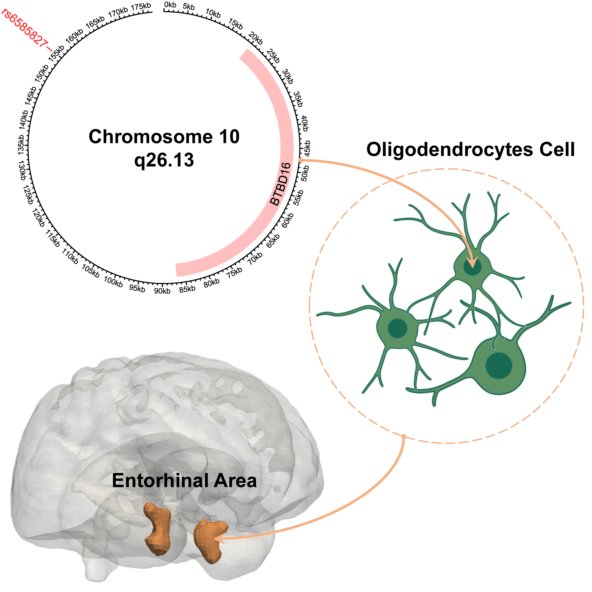

# Brain-wide genome-wide colocalization study for integrating genetics, transcriptomics and brain morphometry in Alzheimer’s disease

The GWAS summary statistics and supplementary materials are available at https://upenn.box.com/s/w76hbj2937dag58ugriuvyvnnb62eij3

[ShenLab@Penn](https://www.med.upenn.edu/shenlab/)
[LongLab@Penn](https://www.med.upenn.edu/long-lab/)

# Abstract 

Alzheimer’s disease (AD) is one of the most common neurodegenerative diseases. However, the AD mechanism has not yet been fully elucidated to date, hindering the development of effective therapies. In our work, we perform a brain imaging genomics study to link genetics, single-cell gene expression data, tissue-specific gene expression data, brain imaging-derived volumetric endophenotypes, and AD diagnosis to discover potential underlying neurobiological pathways for AD. To do so, we perform brain-wide genome-wide colocalization analyses to integrate multidimensional imaging genomic biobank data. Specifically, we use (1) the individual-level imputed genotyping data and magnetic resonance imaging (MRI) data from the UK Biobank, (2) the summary statistics of the genome-wide association study (GWAS) from multiple European ancestry cohorts, and (3) the tissue-specific cis-expression quantitative trait loci (cis-eQTL) summary statistics from the GTEx project. We apply a Bayes factor colocalization framework and mediation analysis to these multi-modal imaging genomic data. As a result, we derive the brain regional level GWAS summary statistics for 145 brain regions with 482,831 single nucleotide polymorphisms (SNPs) followed by posthoc functional annotations. Our analysis yields the discovery of a potential AD causal pathway from a systems biology perspective: the SNP chr10:124165615:G>A (rs6585827) mutation upregulates the expression of BTBD16 gene in oligodendrocytes, a specialized glial cells, in the brain cortex, leading to a reduced risk of volumetric loss in the entorhinal cortex, resulting in the protective effect on AD. We substantiate our findings with multiple evidence from existing imaging, genetic and genomic studies in AD literature. Our study connects genetics, molecular and cellular signatures, regional brain morphologic endophenotypes, and AD diagnosis, providing new insights into the mechanistic understanding of the disease.  Our findings can provide valuable guidance for subsequent therapeutic target identification and drug discovery in AD. 

# Framework

Our brain-wide genome-wide colocalization framework integrates the analyses of multidimensional biobank data including genetics, tissue-specific gene expression data, brain imaging-derived volumetric endophenotypes, and AD diagnosis (Figure 1). It provides an efficient and explainable bioinformatics strategy to discover potential underlying neurobiological pathways for AD. In this framework, we first performed a brain-wide genome-wide imaging genomics association study (Figure 1 Block 4) using UKBB MRI data (Figure 1 Block 2) and genotyping data (Figure 1 Block 3).  After that, we conducted a colocalization analysis to integrate summary statistics from our imaging genomics study with the existing AD GWAS summary statistics (Bellenguez et al. 2022) (Figure 1 Block 1) to identify SNPs associated with both imaging QTs (iQTs) and AD diagnosis (Figure 1 Block 5). For each identified (SNP, iQT, diagnosis) triplet, we further performed mediation analyses to discover significant mediation relationships from SNP to iQT to diagnosis (Figure 1 Block 6). For each significant SNP→iQT→diagnosis mediation relationship, we performed another colocalization analysis using the GWAS summary data for the GTEx v7 tissue-specific gene expression QTs (eQTs) (Figure 1 Block 7) to identify SNPs related to both tissue-specific gene expression QT (eQT) and imaging-based brain volumetric QT (iQT) (Figure 1 Block 8). Integrating all the above findings, we discovered a putative AD pathway from genetics (SNP) to tissue-specific gene expression QT (eQT), to imaging-based brain volumetric QTs (iQTs), and finally to AD diagnosis. Finally, we performed tissue-specific and cell-type-specific differential expression analyses using brain samples to characterize our imaging genomic findings (Figure 1 Block 9 and Block 10).

	

# GWAS

We performed GWAS on volumetric imaging QTs of 145 MUSE ROIs using the preprocessed genotyping data (Figure 2).

	

# Brain-wide genome-wide colocalization analysis

Genetic colocalization is a method investigating if two potentially related phenotypic traits share the common genetic causal variants in a given genome region. In our study, we performed brain-wide genome-wide colocalization analyses on 145 MUSE ROIs and AD/CN diagnoses using the GWAS summary statistics (Figure 3). 

	

# Conclusion

In summary, our brain-wide genome-wide colocalization study has identified a putative neurobiological pathway from genetics, molecular and cellular signatures, regional brain morphologic endophenotypes, to AD diagnosis (Figure 4). It yields new insights into the mechanistic understanding of AD, and provides valuable information for subsequent therapeutic target identification and drug discovery. 

	

# Acknowledgments

This study was partly supported by NIH grants S10 OD023495, U01 AG068057, U01 AG066833, R01 AG071470, R01 LM013463, R01 AG058854, RF1 AG068191, RF1 AG063481, R01 AG071174. This research has been conducted using data from UK Biobank, a major biomedical database. 
